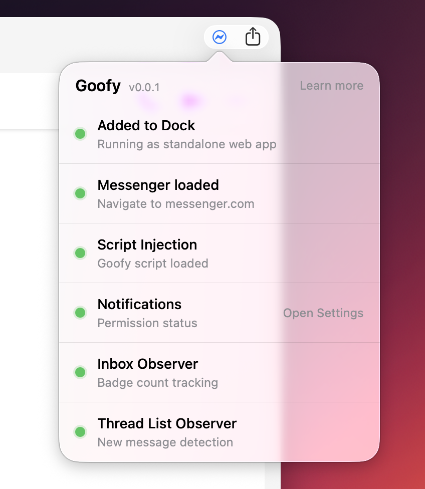
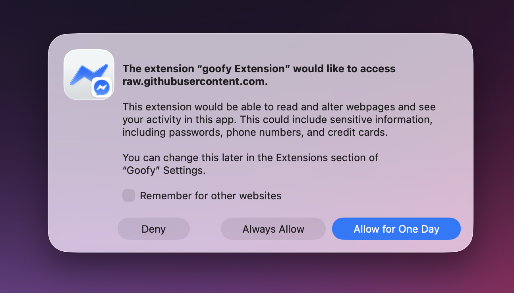
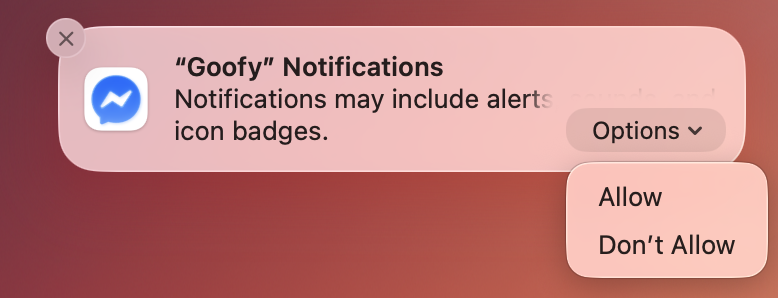

# Goofy for Messenger

A Safari extension that brings native macOS notifications and badge counts to Facebook Messenger.

## What is Goofy?

Goofy allows you to create a Safari web app for Facebook Messenger with real macOS notifications and an unread badge count.

**Important:** Goofy only works when you are running Messenger as a standalone Dock web app, not in a regular Safari browser tab. The app needs to be running for notifications and badge counts to work.

## Features

**Native Notifications**  
Receive macOS notifications when new messages arrive while the app is running. Click a notification to jump directly to that conversation. Note: Notifications only work when the Messenger app is open.

**Badge Counter**  
See your unread message count displayed on the Messenger app icon in your Dock, just like a native app. The badge updates while the app is running.

## Installation

### Step 1: Download Goofy

[Download Goofy on the Mac App Store](APP_STORE_LINK)

### Step 2: Add Messenger to Your Dock

Goofy requires Messenger to run as a standalone Dock app. Here's how to set it up:

1. Open **Safari** and go to [messenger.com](https://www.messenger.com)
2. Log in to your Facebook account
3. In the menu bar, click **File > Add to Dock** (or press `⌘ + Shift + D`)
4. Change the URL to `https://www.messenger.com/` (otherwise it may open to a specific conversation)
5. Optionally, click the icon to choose a custom one. You can download a Messenger icon from [macosicons.com](https://macosicons.com/#/Messenger).
6. Give the app a name (e.g., "Messenger") and click **Add**
7. Messenger will now appear in your Dock as a standalone app

### Step 3: Enable the Extension

1. In the menu bar of the app, click **Messenger > Settings** (or press `⌘ + ,`)
2. Click the **Extensions** tab
3. Find **Goofy** in the list and check the box to enable it
4. When prompted, allow the extension to run on messenger.com
5. ⚠️ **Restart the Messenger app to apply changes**
6. Click the Goofy icon in the toolbar to open the diagnostic panel and verify everything is working

### Step 4: Grant Permissions

On first run, Goofy will ask for permissions:

**Extension access**: Allow the extension to run on `messenger.com` and access `raw.githubusercontent.com` to load the extension's content script.

**Notifications**: Allow notifications so you can receive message alerts.

If you don't see a notification prompt, mark a chat as unread to trigger one. You can also manage notification permissions in **System Settings > Notifications**.

## Troubleshooting

If notifications or badge counts aren't working:

1. **Reload the app**: Press `⌘ + R` to refresh the page
2. **Restart the app**: Quit and reopen the Messenger app from your Dock
3. **Check the health diagnostics**: Click the Goofy icon in the app's toolbar in the upper right corner to open the diagnostic panel and verify all components are working correctly. The icon only shows up when the extension is enabled and "Show navigation controls" is turned on in settings.

## Follow for Updates

Follow [Daniel Büchele on Threads](https://www.threads.com/@danielbuechele) for updates and announcements about Goofy.
